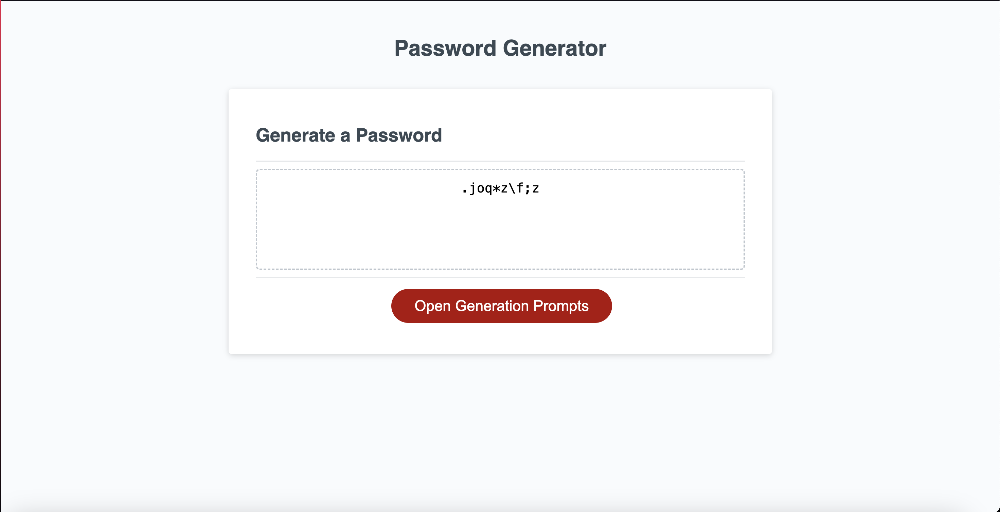

# Challenge-3 PASSWORD GENERATOR README

## Intoduction
This is the README for the Third Challenge of my coding bootcamp. This repository contains a basic website, which I refactored and added javascript to, which allows it to now generate random passwords based on option selected through prompt inputs.

## Things Learned
Through this challenge, I was able to learn how to use javascript to add prompts for user input. I learned how to make a script react to user inputs to generate a different outcome basted on the options selected. I also learned a little on how to used the Math.js library, as well as subscripts.

### Link to Deployed REPO
[Click me!](https://spikey1289.github.io/Password-Generator/)

### Screenshot of Finished Website
